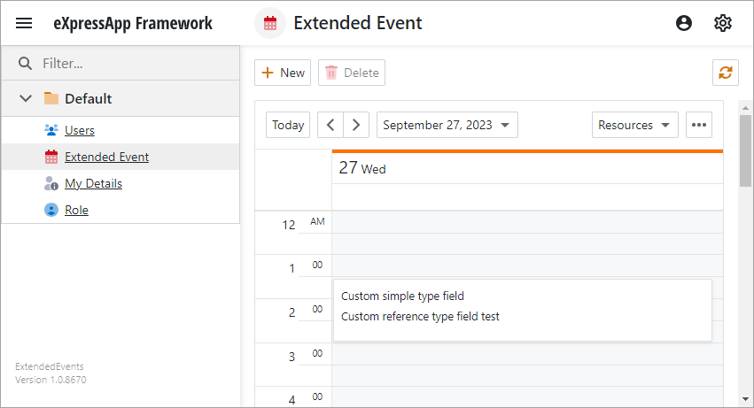
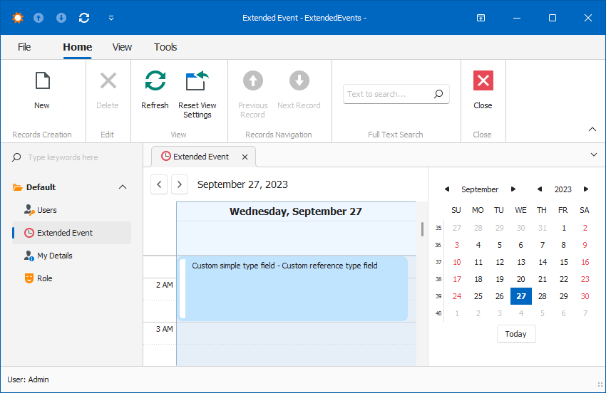

# XAF - How to Display an Event with Custom Fields in a Scheduler List View

This example demonstrates how to extend an event with custom fields and display them in Scheduler.

**ASP.NET Core Blazor**  

**Windows Forms**  

1. Inherit from the `Event` class and implement new properties. For details, see the following file: [ExtendedEvent.cs](./CS/EFCore/ExtendedEvents.Module/BusinessObjects/ExtendedEvent.cs).
2. Map the new properties to the appropriate data fields. For details, see the following files:
   - [SchedulerCustomFieldMappingsController.cs](./CS/EFCore/ExtendedEvents.Blazor.Server/Controllers/SchedulerCustomFieldMappingsController.cs) (ASP.NET Core Blazor)
   - [SchedulerCustomFieldMappingsController.cs](./CS/EFCore/ExtendedEvents.Win/Controllers/SchedulerCustomFieldMappingsController.cs) (Windows Forms)
3. Use the properties in the appointment card.

   In an XAF ASP.NET Core Blazor application:
   - Create a Razor component. For implementation details, refer to the following file: [CustomAppointmentTemplate.razor](./CS/EFCore/ExtendedEvents.Blazor.Server/CustomAppointmentTemplate.razor).
   - Set up VerticalAppointmentTemplate and HorizontalAppointmentTemplate properties of Scheduler View. For implementation details, refer to the following file: [SchedulerCustomFieldMappingsController.cs](./CS/EFCore/ExtendedEvents.Blazor.Server/Controllers/SchedulerCustomFieldMappingsController.cs).

   In an XAF Windows Forms application:
   - Handle the InitAppointmentDisplayText event. For implementation details, refer to the following file: [SchedulerCustomFieldMappingsController.cs](./CS/EFCore/ExtendedEvents.Win/Controllers/SchedulerCustomFieldMappingsController.cs).

## Files to Review

- [ExtendedEvent.cs](./CS/EFCore/ExtendedEvents.Module/BusinessObjects/ExtendedEvent.cs)
- [CustomAppointmentTemplate.razor](./CS/EFCore/ExtendedEvents.Blazor.Server/CustomAppointmentTemplate.razor)
- [SchedulerCustomFieldMappingsController.cs](./CS/EFCore/ExtendedEvents.Blazor.Server/Controllers/SchedulerCustomFieldMappingsController.cs) (ASP.NET Core Blazor)
- [SchedulerCustomFieldMappingsController.cs](./CS/EFCore/ExtendedEvents.Win/Controllers/SchedulerCustomFieldMappingsController.cs) (Windows Forms)
